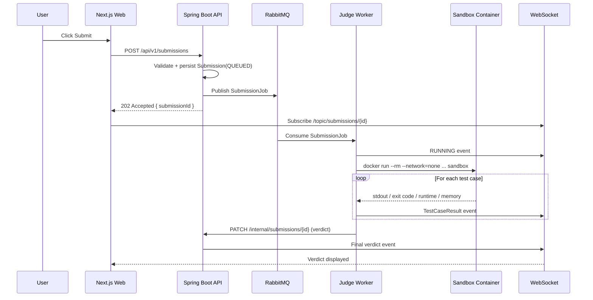
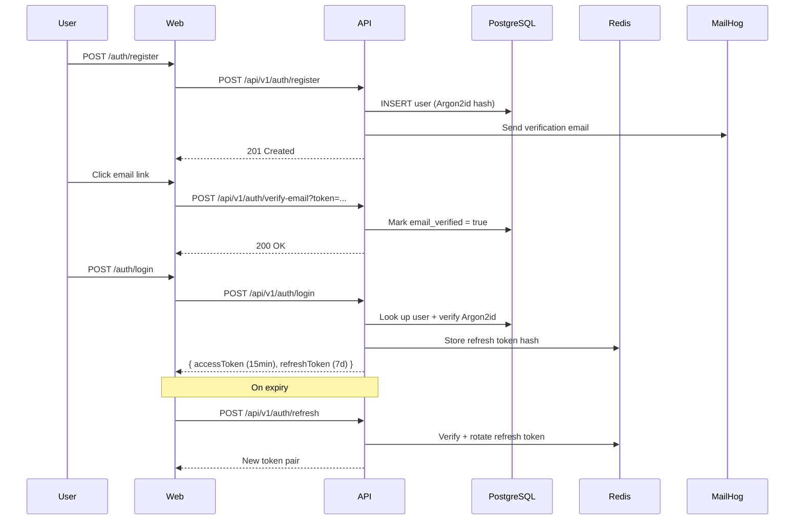
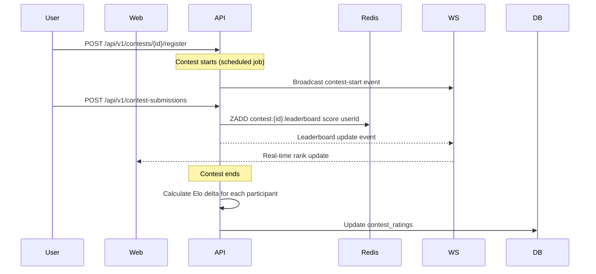

# Architecture

## System Overview

```
[ Next.js 14 Web ] ──► [ Spring Boot 3.3 API ] ──► [ PostgreSQL 16 ]
                               │   │
                               │   ├─► [ Redis 7 ]   (cache · rate-limit · leaderboard)
                               │   └─► [ MinIO ]     (avatars · editorials · archives)
                               │
                               ▼
                      [ RabbitMQ submissions queue ]
                               │
                               ▼
                     [ Judge Worker Pool (Java 21) ]
                               │
                               ▼
           [ Docker → isolated sandbox containers ]
                               │
                               ▼
                     [ verdict → WS → UI ]
```

## Submission Flow



## Auth Flow (Email + Password)



## Contest Flow



## Component Responsibilities

| Component | Responsibility |
|-----------|---------------|
| Next.js Web | UI, SSR, OAuth redirect handling, WebSocket client |
| Spring Boot API | Business logic, auth, REST endpoints, WS broker |
| PostgreSQL | Source of truth for all persistent data |
| Redis | Cache, JWT blacklist, rate limiting, leaderboards (sorted sets) |
| RabbitMQ | Decouples submission intake from execution; durable queue |
| Judge Worker | Pulls jobs, orchestrates Docker sandboxes, writes verdicts |
| MinIO | Object storage for avatars, editorials, submission archives |
| Prometheus + Grafana | Metrics and dashboards |

## Sandboxing Strategy

See [security.md](security.md) for full threat model. Summary:

- One container per submission, killed after verdict
- `--network=none` — no outbound network
- `--read-only` rootfs — no filesystem writes
- `--tmpfs /tmp:size=64m,exec` — ephemeral write space
- `--memory=256m --memory-swap=256m` — cgroup memory cap
- `--cpus=1.0` — CPU quota
- `--pids-limit=64` — anti fork-bomb
- `--security-opt seccomp=judge.json` — custom syscall filter
- `--user 65534:65534` (nobody) — no privilege
