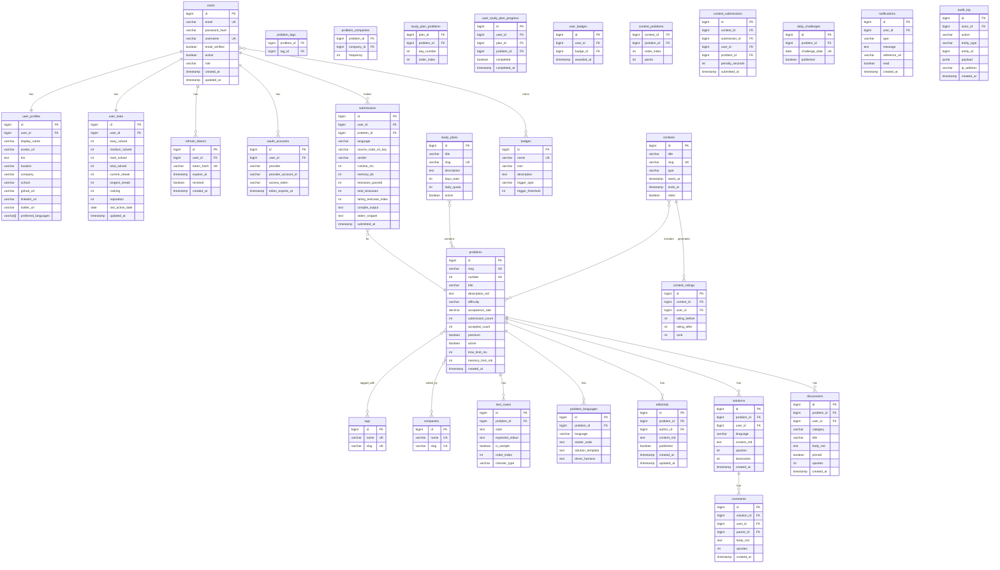

# Database Schema (ER Diagram)

> Full Flyway migrations in `backend/src/main/resources/db/migration/`

## Core Entities

```mermaid
erDiagram
    users {
        bigint id PK
        varchar email UK
        varchar password_hash
        varchar username UK
        boolean email_verified
        boolean active
        varchar role
        timestamp created_at
        timestamp updated_at
    }

    user_profiles {
        bigint id PK
        bigint user_id FK
        varchar display_name
        varchar avatar_url
        text bio
        varchar location
        varchar company
        varchar school
        varchar github_url
        varchar linkedin_url
        varchar twitter_url
        varchar[] preferred_languages
    }

    user_stats {
        bigint id PK
        bigint user_id FK
        int easy_solved
        int medium_solved
        int hard_solved
        int total_solved
        int current_streak
        int longest_streak
        int ranking
        int reputation
        date last_active_date
        timestamp updated_at
    }

    refresh_tokens {
        bigint id PK
        bigint user_id FK
        varchar token_hash UK
        timestamp expires_at
        boolean revoked
        timestamp created_at
    }

    oauth_accounts {
        bigint id PK
        bigint user_id FK
        varchar provider
        varchar provider_account_id
        varchar access_token
        timestamp token_expires_at
    }

    problems {
        bigint id PK
        varchar slug UK
        int number UK
        varchar title
        text description_md
        varchar difficulty
        decimal acceptance_rate
        int submission_count
        int accepted_count
        boolean premium
        boolean active
        int time_limit_ms
        int memory_limit_mb
        timestamp created_at
    }

    tags {
        bigint id PK
        varchar name UK
        varchar slug UK
    }

    problem_tags {
        bigint problem_id FK
        bigint tag_id FK
    }

    companies {
        bigint id PK
        varchar name UK
        varchar slug UK
    }

    problem_companies {
        bigint problem_id FK
        bigint company_id FK
        int frequency
    }

    test_cases {
        bigint id PK
        bigint problem_id FK
        text stdin
        text expected_stdout
        boolean is_sample
        int order_index
        varchar checker_type
    }

    problem_languages {
        bigint id PK
        bigint problem_id FK
        varchar language
        text starter_code
        text solution_template
        text driver_harness
    }

    submissions {
        bigint id PK
        bigint user_id FK
        bigint problem_id FK
        varchar language
        varchar source_code_s3_key
        varchar verdict
        int runtime_ms
        int memory_kb
        int testcases_passed
        int total_testcases
        int failing_testcase_index
        text compile_output
        text stderr_snippet
        timestamp submitted_at
    }

    editorials {
        bigint id PK
        bigint problem_id FK
        bigint author_id FK
        text content_md
        boolean published
        timestamp created_at
        timestamp updated_at
    }

    solutions {
        bigint id PK
        bigint problem_id FK
        bigint user_id FK
        varchar language
        text content_md
        int upvotes
        int downvotes
        timestamp created_at
    }

    comments {
        bigint id PK
        bigint solution_id FK
        bigint user_id FK
        bigint parent_id FK
        text body_md
        int upvotes
        timestamp created_at
    }

    discussions {
        bigint id PK
        bigint problem_id FK
        bigint user_id FK
        varchar category
        varchar title
        text body_md
        boolean pinned
        int upvotes
        timestamp created_at
    }

    study_plans {
        bigint id PK
        varchar title
        varchar slug UK
        text description
        int days_total
        int daily_quota
        boolean active
    }

    study_plan_problems {
        bigint plan_id FK
        bigint problem_id FK
        int day_number
        int order_index
    }

    user_study_plan_progress {
        bigint id PK
        bigint user_id FK
        bigint plan_id FK
        bigint problem_id FK
        boolean completed
        timestamp completed_at
    }

    badges {
        bigint id PK
        varchar name UK
        varchar icon
        text description
        varchar trigger_type
        int trigger_threshold
    }

    user_badges {
        bigint id PK
        bigint user_id FK
        bigint badge_id FK
        timestamp awarded_at
    }

    contests {
        bigint id PK
        varchar title
        varchar slug UK
        varchar type
        timestamp starts_at
        timestamp ends_at
        boolean rated
    }

    contest_problems {
        bigint contest_id FK
        bigint problem_id FK
        int order_index
        int points
    }

    contest_submissions {
        bigint id PK
        bigint contest_id FK
        bigint submission_id FK
        bigint user_id FK
        bigint problem_id FK
        int penalty_seconds
        timestamp submitted_at
    }

    contest_ratings {
        bigint id PK
        bigint contest_id FK
        bigint user_id FK
        int rating_before
        int rating_after
        int rank
    }

    daily_challenges {
        bigint id PK
        bigint problem_id FK
        date challenge_date UK
        boolean published
    }

    notifications {
        bigint id PK
        bigint user_id FK
        varchar type
        text message
        varchar reference_url
        boolean read
        timestamp created_at
    }

    audit_log {
        bigint id PK
        bigint actor_id FK
        varchar action
        varchar entity_type
        bigint entity_id
        jsonb payload
        varchar ip_address
        timestamp created_at
    }

    users ||--|| user_profiles : has
    users ||--|| user_stats : has
    users ||--o{ refresh_tokens : has
    users ||--o{ oauth_accounts : has
    users ||--o{ submissions : makes
    problems ||--o{ test_cases : has
    problems ||--o{ problem_languages : has
    problems }o--o{ tags : tagged_with
    problems }o--o{ companies : asked_by
    submissions }o--|| problems : for
    problems ||--o{ editorials : has
    problems ||--o{ solutions : has
    solutions ||--o{ comments : has
    problems ||--o{ discussions : has
    study_plans }o--o{ problems : contains
    users }o--o{ badges : earns
    contests }o--o{ problems : includes
    contests ||--o{ contest_ratings : generates
```
